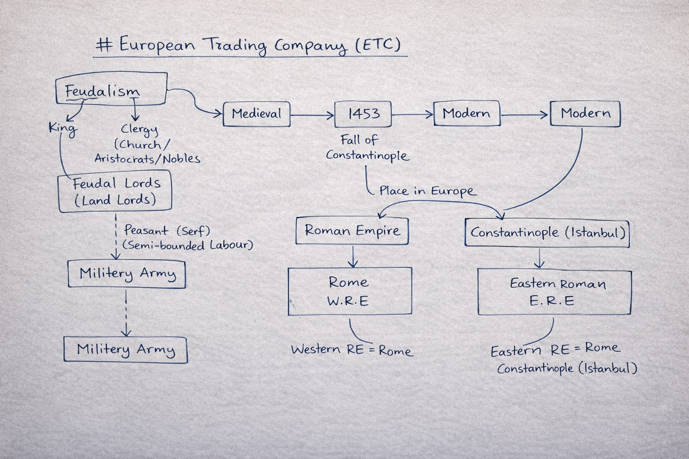
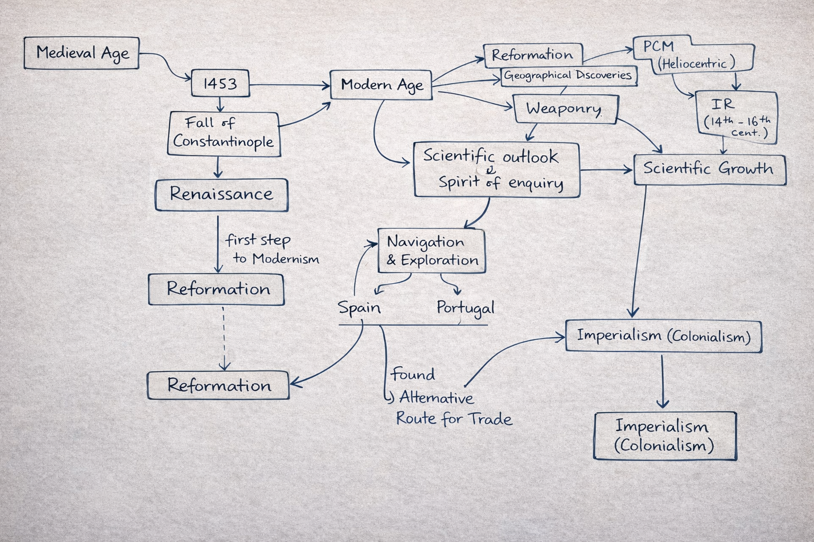

# European Trading Company

## Introduction
In **1453**, the city of **Constantinople** was captured by the **Ottoman Turks**. Following this, Arab merchants came to dominate the land and sea routes in the Middle East. Consequently, Europeans became dependent on Arab intermediaries who monopolized the Red Sea routes connecting European markets with Asia. In this situation, Europeans were eager to find an alternative sea route to the Indian subcontinent to eliminate their dependency on Arab merchants. This led to the discovery of a direct sea route, which was the first step toward the process of **Imperialism** by European powers in **Asia** and **Africa**.

---

## Portuguese East India Company
The Portuguese venture was a royal monopoly and a joint-stock company. They reached India in **1498** when **Vasco da Gama** arrived at Calicut via the **Cape of Good Hope**. He became the first European to successfully sail from Europe to India directly, bypassing the traditional Caravan Silk Route.

* **Arrival:** He reached Calicut in May 1498, guided by a **Gujarati Pilot** named **Abdul Majid**.
* **Reception:** He was granted a grand reception by the local Hindu King of Calicut, **Samoothiri**, who held the title of **Zamorin**.

During his three-month stay, Da Gama gathered exotic Indian **spices (including black pepper)**, **silk**, **gems**, and **rare herbs**, which he sold at huge profits upon returning to Portugal. His second visit was in 1502, focusing on building factories (warehouses) to increase trade flow. Despite strained relations with the Zamorin and challenges from Arab traders, the Portuguese managed to establish several settlements.

### Key Factories
1.  **Calicut** (Kozhikode)
2.  **Cochin** (Kochi) - *Early Headquarters*
3.  **Quilon** (Kollam)
4.  **Cannanore** (Kannur)
*Other settlements:* Mangalore, Salsette, Bassein, Surat, and Daman.
*Note:* The headquarters was later shifted to **Goa** by **Nino da Cunha**.

### Items of Trade
* **Monopoly:** Spices (mainly black pepper) and Horses.
* **Other Goods:** Indigo, Textiles, Ivory, and Slaves.

---

## Important Governor Generals

### Francisco de Almeida
He was the first Portuguese Governor General and was responsible for establishing the Portuguese Empire in India. He began consolidating interests by building forts: **Fort St. Angelo** (Cannanore), **Fort Manuel** (Cochin), and **Anjediva**.

* **Blue Water Policy:** Issued by Almeida to establish Portuguese supremacy over the Indian Ocean. The goal was to build a strong naval force rather than focusing on territorial expansion on land.
* **Success:** This policy led to victory in the **Battle of Diu (1509)**, securing dominance in Western India.

### Alfonso de Albuquerque
He is considered the most important Governor General. Under his leadership, the Portuguese established bases at the **Strait of Hormuz**, **Malabar**, and the **Strait of Malacca**.

* **Cartaz System:** A licensing system where the Portuguese forced all merchant ships to buy a pass. Failure to do so resulted in the confiscation of the ship and its goods.
* **Expansion:** He acquired **Goa** from the Sultan of Bijapur in **1510**, making it the capital of the Portuguese in India. He also successfully captured **Bhatkal** from **Krishnadevaraya (KDR)**.
* **Social Policy:** He encouraged Portuguese men to marry Indian women to create a permanent settlement and spread Christianity.

---

## Strategic Locations
> **Strait of Hormuz:** A crucial choke point connecting the Persian Gulf to the Arabian Sea. Around 1/5th of the world's oil supply moves through it today.
>
> **Strait of Malacca:** A narrow maritime passage linking the Indian Ocean with the South China Sea; it is one of the world's busiest shipping lanes.

---

## Religious Missions
In 1542, the Christian missionary **St. Francis Xavier** arrived during the time of **Martin D'Souza**. He led the conversion of two important fishing communities, the **Mukkuvars** and the **Paravars**, to Christianity.

## Contribution of the Portuguese
* **Agriculture:** Introduction of **Tobacco, Potatoes, Pineapples, Chilies, and Tomatoes**.
* **Printing:** Established the **First Printing Press** in Goa (1556).
* **Science:** Published the first scientific work on Indian medicinal plants.s
