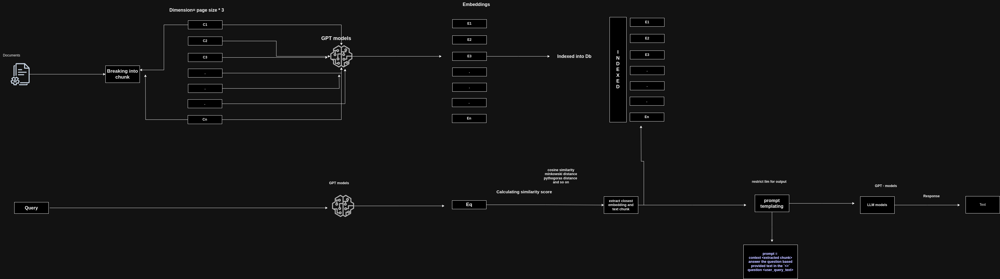

# PART 1: How RAG application works

[RAG Application](../images/rag_part1.jpeg)

## Introduction

This is the first post of a complete series of posts that will cover every bits and pieces of RAG internals. We will mostly focus on intuitive understanding of technologies and concepts used in RAG. We will also cover the architecture and design of **RAG** in detail.

Before doing anythings, the very obvious question that comes to our mind is what is RAG?. Why it is more popular now a days?.

So to begin with let's first understand what is RAG.

## What is RAG(Retrieval Augmented Generation) ?

RAG is a technique for augmenting LLM knowledge with additional data.

LLMs can reason about wide-ranging topics, but their knowledge is limited to the public data up to a specific point in time that they were trained on. If you want to build AI applications that can reason about private data or data introduced after a model's cutoff date, you need to augment the knowledge of the model with the specific information it needs. The process of bringing the appropriate information and inserting it into the model prompt is known as **Retrieval Augmented Generation (RAG)**.

RAG is a technique for augmenting LLM knowledge with additional data. It is a combination of two models: a retriever and a generator. The retriever is responsible for finding relevant information from a large corpus of documents, while the generator is responsible for generating the final output.

## How RAG works? 

RAG works by first retrieving relevant information from a large corpus of documents using a retriever model. The retriever model is trained to find the most relevant information given a query. Once the relevant information is retrieved, it is passed to a generator model, which generates the final output.

If this make no sense to you, don't worry. We will go step by step and understand each component of RAG in detail.

Let's take an example to understand it visually. If you are a developer you might have used chatgpt, gemini, anthropic, copilot or any other LLM model. These models are trained on large corpus of data and can generate human like text. But what if you want to generate text based on some specific data that is not present in the training data of these models. This is where RAG comes into picture. RAG can be used to augment the knowledge of these models with additional data.

